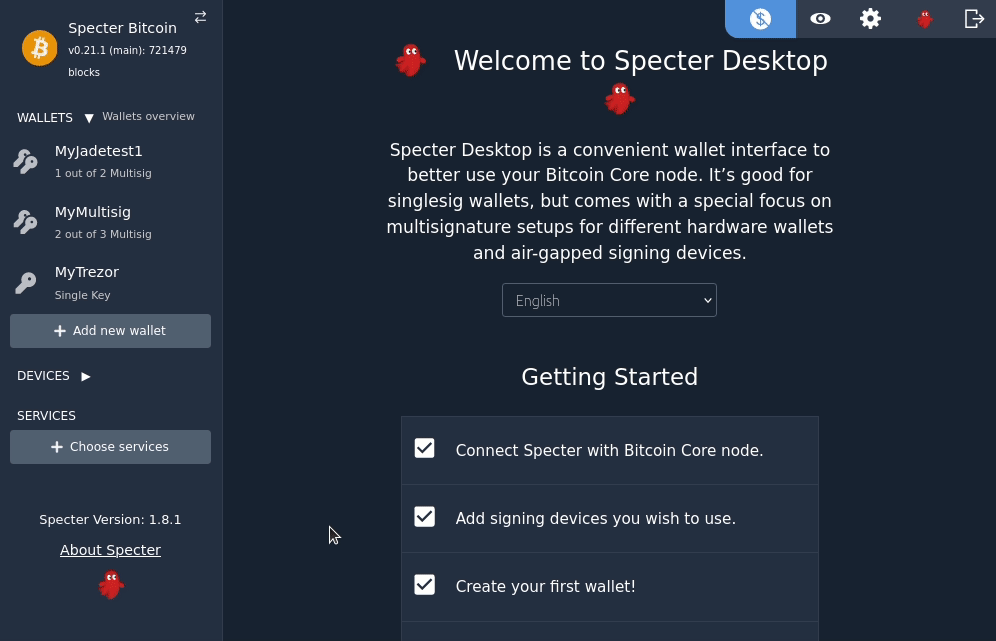

This is a minimal extension which should get you started if you want to contribute to specter via an 
extension.

# Get it to run

In oder to use this:
```
git clone git@github.com:cryptoadvance/specterext-dummy.git
cd specterext-dummy
pip3 install virtualenv
virtualenv --python=python3 .env
source .env/bin/activate
pip3 install -r requirements.txt
python3 -m cryptoadvance.specter server --config DevelopmentConfig --debug
# point your browser to http://localhost:25441
# "choose Services" --> dummy
```



# How to get this to production?
The above setup is describing a Development Environment for your extension. If you ommit the `--config DevelopmentConfig`, it'll no longer work. We don't want in a ProductionConfig, that arbitrary files get imported by python.
So in order to specify explicitely which extensions to load, there is a list in the [ProductionConfig](https://github.com/cryptoadvance/specter-desktop/blob/master/src/cryptoadvance/specter/config.py#L146-L150). So what you need to do is to first, switch the `devstatus` in your `DummyService`-class to production and then create your own relevant configuration and specify the extensions you want to load.
You could do that e.g. by creating a file in `./dummy/appConfig.py` with this content:
```
from cryptoadvance.specter.config import ProductionConfig


class Config(ProductionConfig):
    EXTENSION_LIST=[
        "dummy.service"
    ]
```

Then you'd start specter like this:
```
python3 -m cryptoadvance.specter server --config dummy.appconfig.Config
```

It's also possible, that you publish your extension on PyPi and use a fully qualified module-name in the `EXTENSION_LIST`. Obviously, you would need to install that in your (virtual-) environment in that case.

# Get Help

If you want help or can't implement what you have in your mind or just want to say hello, join our Telegram-Chat.

https://t.me/+yS4VO2JqBHkzYTI6

If you want to 
